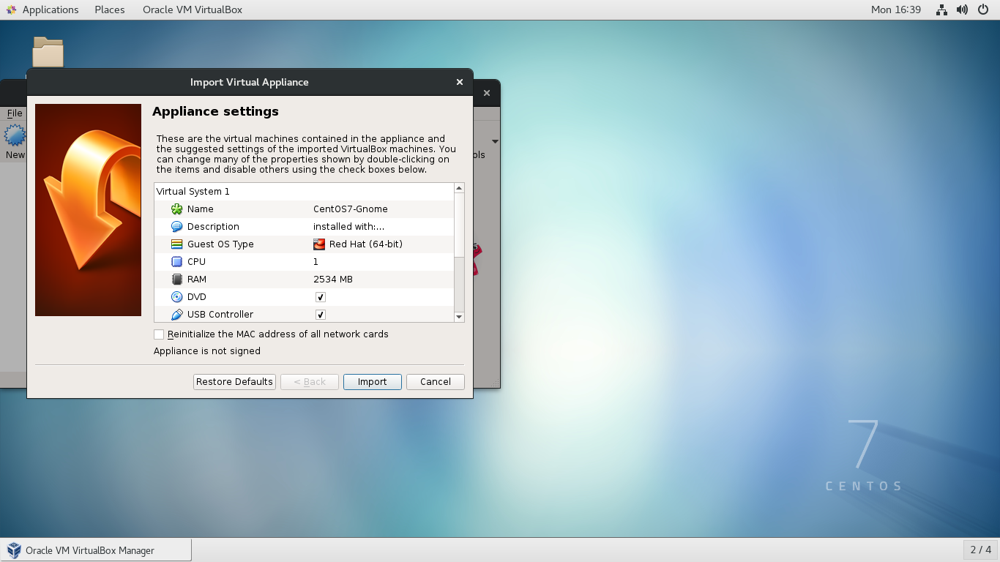
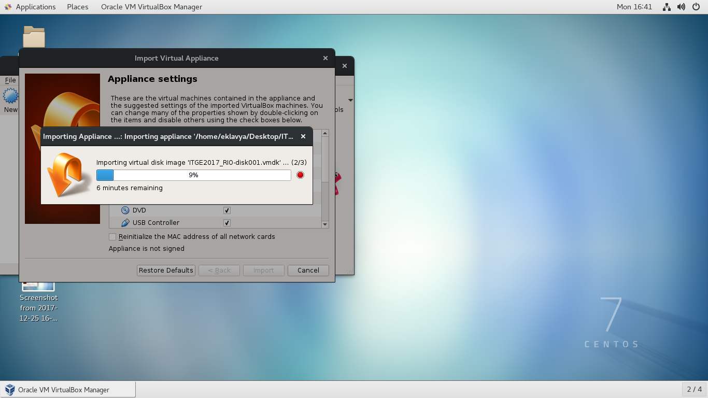
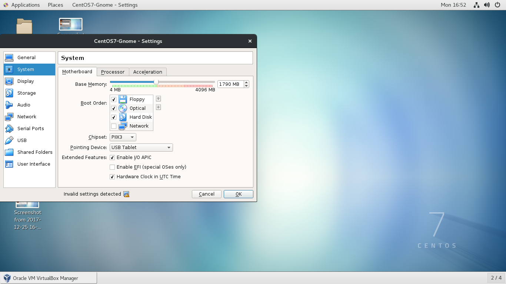
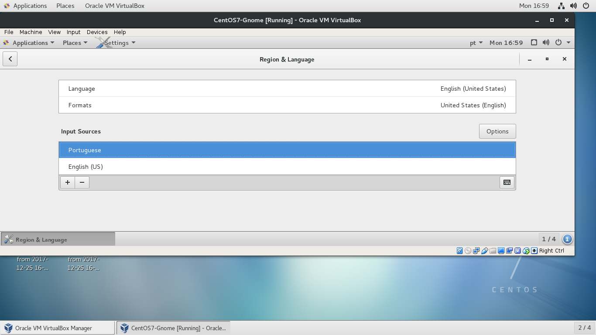
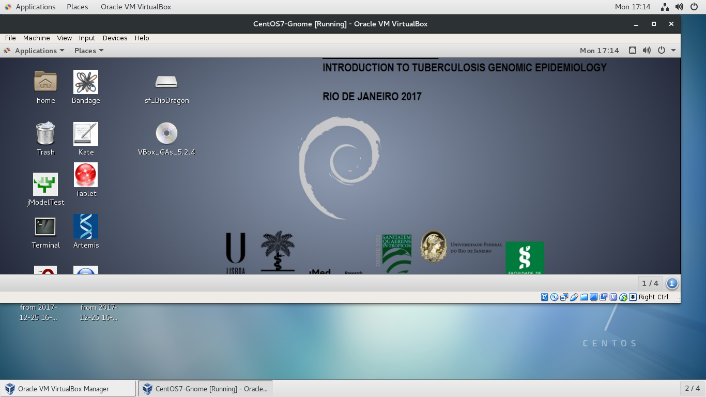
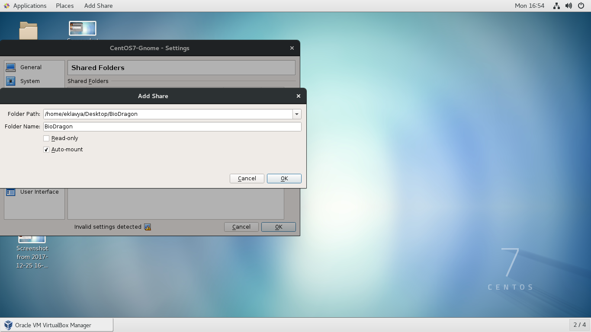

## Install VirtualBox 
This depends on the operating system you are using.

## Setting up VirtualBox image 

- Just double click on the `ITGE2017_RIO.ova` and it should be start virtualbox.
screenshot


- Click on `Import`


  
Re
##### Tweak the settings of the virtual machine

- Before starting
    - Processor
    Set it to `green` levels like so
    

    - RAM
    Set it to `green` levels like so
  
- After starting
    -  Change the keyboard layout
     
    ```
        settings > region and language > input layout > US Keyboard
    ```

- Power options 

```
settings -> power options -> blank screen -> never 
```

- Install VirtualBox guest additions
 
Go to the top menu, 
```
Devices -> Insert Guest additions CD image 
```
 
 
  
   
   
##### Setup shared folder


  
  
 

From inside the virtualbox image, run these commands in the terminal
```
sudo usermod -aG vboxsf $(whoami)

sudo mount -t vboxsf -o rw,uid=1000,gid=1000 BioDragon ~/Desktop/BioDragon/

```

Now you can see a `sf_BioDragon` folder in the virtualbox image

Restart the virtualbox image to have normal usage of `BioDragon` folder.

##### Setup the virtualmachine for connecting with external Hard disk
For this we need to install `oracle virtualbox extensions` 

http://download.virtualbox.org/virtualbox/5.2.4/Oracle_VM_VirtualBox_Extension_Pack-5.2.4-119785.vbox-extpack 

Be *very* careful that the *version* of virtualbox is the same as extension pack. 

Run this command in the Host Operating system

```

sudo VBoxManage extpack install --replace Oracle_VM_VirtualBox_Extension_Pack-5.2.4-119785.vbox-extpack 

```


##### Setup scala-ammonite shell

This is necessary since the steps of the analysis are written in the `scala` language.
```
mkdir -p ~/.ammonite && curl -L -o ~/.ammonite/predef.sc https://git.io/vHaKQ

sudo curl -L -o /usr/local/bin/amm https://git.io/vdNv2 && sudo chmod +x /usr/local/bin/amm && amm

```
